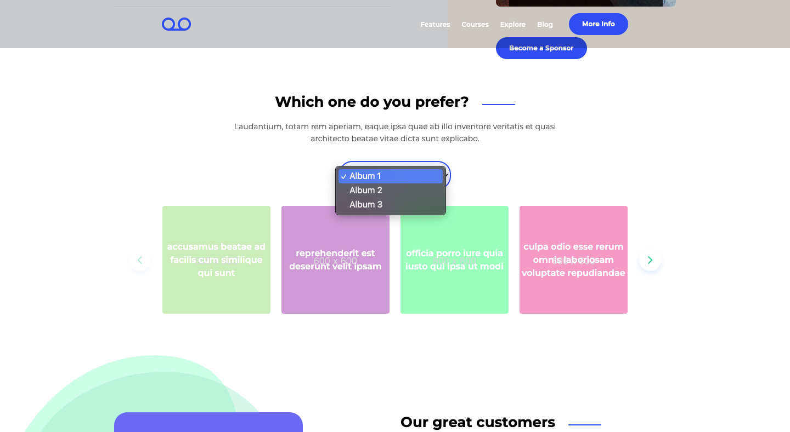
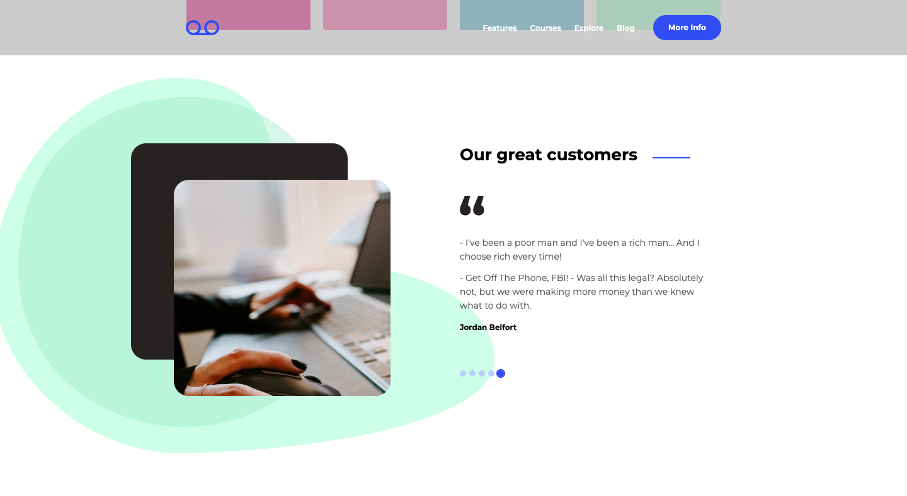
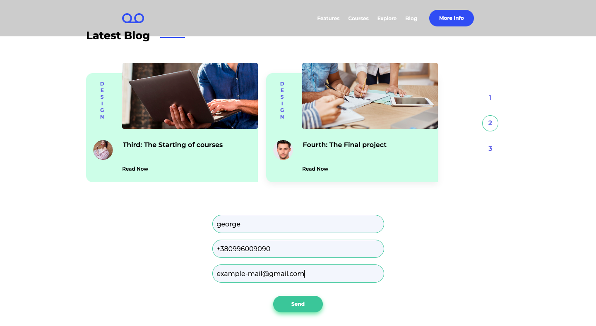

# HYS Academy Landing Page

## Get Started

If you want to see the project without deploying it locally, you can follow this link to GitHub Pages: https://georgedeyneka.github.io/hys_academy

So, if you want to look at the project's code and deploy it, follow the steps below in the "Installation" section.

### Installation

1. Clone the repo
```sh
git clone https://github.com/GeorgeDeyneka/hys_academy.git
```
2. Install NPM packages
```sh
npm install
```
3. Run this command for a dev server. Navigate to `http://localhost:8080/`. The application will automatically reload if you change any of the source files.
```sh
npm run watch
```

## About project

This is my landing page, written with TypeScript and assembled by the Gulp builder. The SCSS preprocessor was used to style the project. It is well optimized for different devices as it uses responsive design and is written using the Mobile First technique.

### Built With

- 
- 
- 
- 
- 
- 
- 
- 
- 

## Usage

### Start section
<div>
  <ul>
    <li>
When you open a project, you see the start page. So, you can navigate through the sections using the navigation buttons.
    </li>
    </br>
    <li>
All links to companies open on the pages of these companies in a new tab.
    </li>
  </ul>
  </br>

</div>

</br>

---

### Online courses
<div>
  <ul>
    <li>
Moving down the page, you will be taken to the slider section.
    </li>
    </br>
    <li>
It is connected and works using the jQuery library, and has all the necessary settings for the adaptive version of the site, and is also configured according to the requirements of the project.
    </li>
    </br>
    <li>
Pay attention to the star rating: it is automatically calculated from the incoming property data, so you just see the stars of the rating.
    </li>
  </ul>
  </br>

</div>

</br>

---

### Which one do you prefer?
<div>
  <ul>
    <li>
So, you have reached the next section with the slider. I wrote it without using any third party libraries.
    </li>
    </br>
    <li>
      It is worth noting that the animation of all interaction elements on the page, whether it be sliders or pagination, is written in the same style. This helps maintain the overall style of the project and allows the application to look cohesive.
    </li>
      </br>
    <li>
So, in this slider you can change the Album categories, which automatically changes the data received from the server. The images and text of the slides are taken from the provided API.
    </li>
  </ul>
  </br>

</div>
</br>

---

### Our great customers
<div>
  <ul>
    <li>
The next section provides a simple pagination. It is also written without the use of third party libraries.
    </li>
    </br>
    <li>
You can see the image, background color and text change. By the way, I had the freedom of imagination in the choice of text content, so I gave quotes from famous world cinema masterpieces.
    </li>
  </ul>
  </br>

</div>

</br>

---

### Latest blog, form
<div>
  <ul>
    <li>
Here is the last section of the site - pagination and a form to fill out.
    </li>
    </br>
    <li>
The pagination shows two elements and also has a smooth animation transition.
    </li>
    </br>
    <li>
The form has validation, so you can fill it out without any problems. As you fill out the form, you will see prompts
what data the form expects.
    </li>
    </br>
    <li>
When you click the "Submit" button, the data from the form will be submitted and you will see a modal window with the words of thanks. Try filling out and submitting the form, it's very easy!
    </li>
    </br>
    <li>
Also pay attention to the accessibility of the project and the styling of the focus on each individual element when using the site using the keyboard.
    </li>
  </ul>
  </br>

  </br>
  </br>
  <ul>
    <li>
You are presented with only a small part of the available functionality, so go to the site using the link above and you will see everything for yourself!
    </li>
  </ul>
</div>

</br>

## Contributing

Contributions are what make the open source community such an amazing place to learn, inspire, and create. Any contributions you make are **greatly appreciated**.

If you have a suggestion that would make this better, please fork the repo and create a pull request. You can also simply open an issue with the tag "enhancement".

If you want to improve the project code, you need to:

1. Fork the Project
2. Create your Feature Branch (`git checkout -b feature/AmazingFeature`)
3. Commit your Changes (`git commit -m 'Add some AmazingFeature'`)
4. Push to the Branch (`git push origin feature/AmazingFeature`)
5. Open a Pull Request

Don't forget to give the project a star! Thanks again!

<!-- Say thanks json placeholder & sednev -->

## My Contacts (Links)

- <a href="https://www.linkedin.com/in/george-deyneka-910003238/">
    
  </a> 
- <a href="https://t.me/Deyneka_George">
    
  </a> 
- <a href="mailto: zhoradeynecka@gmail.com">
    
  </a> 
